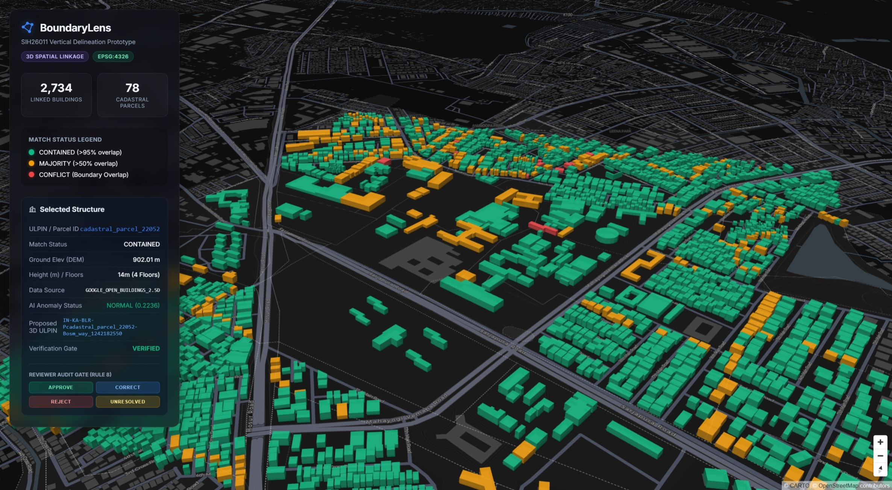

# BoundaryLens:Vertical Delineation Prototype
### Developed by Team areonerds | Smart India Hackathon 2026 (SIH26011)



**BoundaryLens** is a fully functional 3D multi-storey vertical parcel delineation pipeline and interactive Web UI, built specifically by **Team areonerds** for the **Smart India Hackathon 2026 (SIH26011)** problem statement: *"Assigning 3D identities for surface parcels, multi-storey properties and underground infrastructure"*.

This prototype deterministically fuses 2D GIS cadastral layers, satellite-derived multi-storey height constraints, Copernicus DEM terrain elevation, and unsupervised AI anomaly detection to construct **Proposed 3D Vertical ULPINs** without fabricating official government data.

---

## 🎯 Architecture & Implementation Phases
The project is built on a 17-step phase progression, defined strictly by our project constitution `AGENTS.md` and `docs/PHASES.md`. 

| Phase | Description | Key Output / Technology |
| :--- | :--- | :--- |
| **0. Constitution** | Rules of engagement & evidence hierarchy | `AGENTS.md` |
| **1. Data Discovery** | Dataset validation for Bengaluru pilot | OpenCity Cadastral, OSM, Copernicus GLO-30 |
| **2. Ingestion** | Raw data fetching scripts | `scripts/ingestion/` |
| **3. Normalisation** | Uniform CRS standardisation (EPSG:4326/32643) | `GeoPandas` |
| **4. Quality Audit** | Geometric validity checks & cleaning | `Shapely` |
| **5. 2D Spatial Match** | Topological parcel-building intersection | `match_status_2d` (CONTAINED, MAJORITY, CONFLICT) |
| **6. Elevation (DEM)**| Sampling terrain for base ground elevation | `rasterio` (Copernicus DEM) |
| **7. 3D Reconstruction**| Extruding 2D polygons to 3D volumes | `MapLibre GL JS` |
| **8. Real Floor Evidence**| Satellite ML Heights (Google Open Buildings 2.5D) | `floor_entities.json` (8,800+ discrete floors) |
| **9. AI Assistance** | 4D Unsupervised anomaly detection | `scikit-learn` Isolation Forest |
| **10. Fusion Engine** | Deterministic evidence ledger | `evidence_fusion_ledger.json` |
| **11-12. Provenance** | Immutable audit tracking on every output field | Integrated into Phase 10 |
| **13. Human Review** | Interactive reviewer gate in the Web UI | `APPROVE`, `CORRECT`, `REJECT` action logs |
| **14. 3D Vertical ULPINs**| Hierarchical proposed identifiers | `IN-KA-BLR-P78-B12-F3` |
| **15. 3D Web UI** | Glassmorphic, hardware-accelerated frontend | Vanilla HTML/CSS/JS + MapLibre GL |
| **16. SIH Audit** | Final adversarial requirements check | `docs/SIH_AUDIT_VERIFICATION.md` |

---

## ⚙️ How to Reproduce & Run the Pipeline

The entire system is modular, deterministic, and can be reproduced on any local environment.

### 1. Prerequisites
- **Python 3.10+**
- Git

### 2. Setup the Environment
Clone the repository and set up a Python virtual environment:

```bash
git clone https://github.com/sujayghosh13/boundarylens-sih26011.git
cd boundarylens-sih26011

# Create and activate virtual environment
python -m venv venv

# Windows
.\venv\Scripts\activate
# Mac/Linux
source venv/bin/activate
```

### 3. Install Requirements
If a `requirements.txt` is missing or out of date, you can generate/update it at any time using:
```bash
pip freeze > requirements.txt
```
To install the exact dependencies used for this pipeline:
```bash
pip install -r requirements.txt
```
*(Key dependencies: `geopandas`, `shapely`, `rasterio`, `scikit-learn`, `numpy`, `requests`)*

## ⚙️ How to Run: Demo vs Full Pipeline

BoundaryLens provides two execution modes: a **lightweight, offline Demo Launcher** for live judging, and an **end-to-end Master Pipeline** for full reproducibility.

### 1. Live Demonstration (Recommended for SIH Judging)
For a rock-solid, zero-latency presentation without internet dependencies or re-training delays:

1. Run the pre-demo health check:
   ```bash
   python scripts/demo_health_check.py
   ```
2. Start the interactive 3D Web UI:
   ```bash
   python run_demo.py
   # Or on Windows double-click: start_demo.bat
   ```
3. Open **[http://localhost:8000](http://localhost:8000)** in your browser.

> **Why `run_demo.py`?**
> `run_demo.py` uses existing, verified datasets and serves the hardware-accelerated MapLibre 3D interface immediately. It does **not** download gigabytes of raw satellite rasters, call external rate-limited APIs, or retrain ML models.

---

### 2. Full Pipeline Reproducibility (From Scratch)
If judges ask to see data ingestion, topological matching, and ML model training executed end-to-end:

```bash
# 1. Install dependencies
pip install -r requirements.txt

# 2. Run master pipeline
python run_pipeline.py
```

> **Bare-earth DEM without an API key:** For reproducible hackathon runs, a validated bare-earth DEM GeoTIFF is staged at `data/raw/dem/bare_earth_dem.tif` (covering Bengaluru AOI: `77.61365, 12.92365, 77.62635, 12.93635`). When present, OpenTopography is **not contacted** and no API key is required. See [`docs/DATA_SOURCES.md`](docs/DATA_SOURCES.md).

**What `run_pipeline.py` executes in sequence:**
1. **Ingestion**: Fetches vector cadastral parcels, OSM footprints, Copernicus GLO-30 DSM, and bare-earth DEM.
2. **Normalisation (Phases 3-4)**: Standardises CRS (EPSG:4326 / EPSG:32643) and repairs invalid geometries.
3. **2D Topology Match (Phase 5)**: Intersects buildings and parcels (`CONTAINED`, `MAJORITY`, `CONFLICT`).
4. **Elevation Extraction (Phase 6)**: Samples terrain elevation (Z-axis ground level in metres).
5. **Height Derivation & Discrete Floors (Phase 8)**: Derives building heights from observed OSM tags or calibrated urban footprint profiles.
6. **AI Anomaly Detection (Phase 9)**: Runs `scikit-learn` Isolation Forest to detect multi-dimensional topological boundary conflicts.
7. **Evidence Fusion Ledger (Phase 10)**: Compiles immutable provenance for every parcel-building relationship.
8. **NDVI Vegetation Evidence (Phase 11)**: Evaluates Sentinel-2 L2A vegetation signals to verify if elevation peaks are structural vs tree canopy.
9. **Supervised Floor Estimation (Phase 12)**: Evaluates 12,700+ Bengaluru OSM building levels with Random Forest (`OBSERVED` vs `PREDICTED` vs `NOT_DETERMINABLE`).
10. **Launches Web Server**: Serves the 3D application on port 8000.

---

### 3. Using the 3D Web Application During Presentation
1. Open **[http://localhost:8000](http://localhost:8000)**.
2. **3D City View**: Navigate the extruded urban skyline of South Bengaluru.
3. **Select Any Building**: The sidebar displays:
   - **Ground Elevation (DEM)**: True terrain ground level from bare-earth DEM.
   - **Height & Floor Count**: Clear distinction between `Observed` (real OSM tag) and `EST.` (calibrated ML prediction).
   - **AI Anomaly Status**: Flagged by Isolation Forest (`NORMAL` vs `ANOMALY DETECTED`).
   - **Proposed 3D Linkage**: Deterministic hierarchical spatial identifier (e.g. `IN-KA-BLR-P22068-B93697573`).
   - **Verification Gate**: Reviewer status (`VERIFIED`, `PROVISIONAL`, or `HUMAN_VERIFICATION_REQUIRED`).
4. **Simulate Human Reviewer Adjudication**: Click `APPROVE`, `CORRECT`, or `REJECT` on boundary conflict structures and open the **Audit Logs** tab to show live, immutable audit logging.

---

## 📄 Licensing & Data Sources
- **Cadastral Maps**: OpenCity GIS Data (Creative Commons)
- **Building Footprints**: OpenStreetMap (ODbL)
- **Terrain Elevation**: Bare-Earth DEM (SRTM 30m / USGS / AWS Terrain) & Copernicus GLO-30 DEM (Open Access)
- **Height Estimates & Profiles**: Observed OSM `building:levels` tags when present (`OSM_VERIFIED`); calibrated empirical urban profile distribution (`PROVISIONAL / ESTIMATED`) when unobserved.
- **Floor Detection (Phase 12, v3 ML)**: Supervised model —
  **Random Forest trained on 12,700+ OSM `building:levels` labels** across greater Bengaluru (ODbL, whole-cell spatial split, no leakage; test MAE 2.22, within-±1 59.8%). Per building, three clearly separated states: **OBSERVED** (real OSM tag, 16), **PREDICTED** (calibrated ML estimate, labelled *EST.*), and **NOT_DETERMINABLE** (model abstains). Proposed identifiers are spatial linkages for review, **not official government ULPIN issuance**. See [`docs/FLOOR_ESTIMATION.md`](docs/FLOOR_ESTIMATION.md).
- **Vegetation Evidence (NDVI)**: Copernicus Sentinel-2 L2A via public AWS Open Data mirror (*"Contains modified Copernicus Sentinel data"*). Independent evidence layer (Phase 11) evaluating canopy interference. See [`docs/NDVI_VEGETATION_EVIDENCE.md`](docs/NDVI_VEGETATION_EVIDENCE.md).

*Prototype designed for the Smart India Hackathon (SIH 2026). Proposed 3D vertical spatial linkages are for demonstration and reviewer adjudication only and do not constitute official government ULPIN issuance.*
