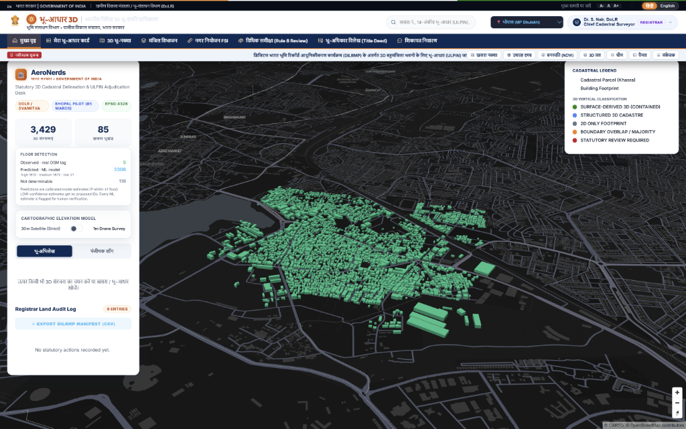

# Bhumi Adhaar: 3D Cadastral & Vertical Property Portal (SIH26011)
### Official Prototype for the Government of India | Developed by Team AeroNerds



**Bhumi Adhaar** (भू-आधार 3D) is an end-to-end 3D multi-storey vertical parcel delineation system and interactive governance portal, engineered by **Team AeroNerds** for the **Smart India Hackathon 2026 (SIH26011)** problem statement: 
> *"Assigning 3D identities for surface parcels, multi-storey properties and underground infrastructure"*.

Designed adhering strictly to the official **UIDAI Government Portal (`https://uidai.gov.in/hi`)** design standards and the statutory guidelines of the **Ministry of Rural Development (DoLR)**, **SVAMITVA Scheme**, and the **Digital India Land Records Modernization Programme (DILRMP)**. It deterministically fuses 2D cadastral Khasra maps, Copernicus bare-earth DEM terrain elevations, Sentinel-2 NDVI canopy evidence, and AI anomaly detection to construct **Proposed 3D Vertical Bhu-Aadhaar (ULPIN) IDs** for individual floor slabs without fabricating land title records.

---

## 🏛️ Government Personas & Workspaces

The platform provides tailored workspaces for three core statutory stakeholders:

| Persona | Authority / Role | Core Statutory Functions |
| :--- | :--- | :--- |
| **Chief Cadastral Surveyor & Registrar** | Department of Land Resources (DoLR), MoRD | • Statutory Reviewer Gate (Rule 8 Adjudication: `APPROVE`, `CORRECT`, `REJECT`)<br>• Immutable Audit Ledger & Event Logging<br>• DILRMP 3D ULPIN CSV Registry Manifest Export |
| **Municipal Town Planner** | Urban Local Body (ULB) / Development Authority | • Real-time FSI / FAR & Floor Sanction Violation Scanner<br>• Structural Height vs Permitted Master Plan Zoning Audit<br>• Non-Compliant High-Density Zone CSV Export |
| **Citizen Landowner** | Indian Citizen / Property Holder | • 3D Bhu-Aadhaar Digital Property Passbook (`Flat 402, 4th Floor`)<br>• Official QR-Coded 3D Land Title Deed Modal (Printable Certificate)<br>• Integrated Revenue SDM Grievance Petition Logging |

---

## 🏢 3D Solid Architectural Mesh Engine & Vertical Parcel Slicing

1. **100% Solid Continuous Extrusions**:
   - Zero hollow gaps or translucent wireframes: Floor slabs form fully continuous, solid 3D architectural masses.
   - Unselected urban mass maintains solid opaque presence (`opacity: 0.85`–`1.0`), eliminating see-through ghosting.
2. **Dual-View Vertical Floor Selection**:
   - **Main MapLibre GL 3D Map**: Direct click interaction on `fill-extrusion` floor slabs highlights the selected vertical level in glowing solid gold (`#f59e0b`), showing altitude above ground.
   - **Three.js Inspection Panel**: Hardware-accelerated 3D model with recursive raycasting, bevelled slabs, edge illumination, and floor-level spatial identifiers.
3. **Discrete 3D Bhu-Aadhaar IDs**:
   - Generates hierarchical floor-level spatial IDs (e.g., `IN-MP-BPL-W43-B20424-F2`, `IN-KA-BLR-P78-B12-F4`) calibrated with ground elevation (m MSL).
4. **Universal Search & Fast Navigation**:
   - Universal search bar supporting instant lookup for Khasra numbers, Survey numbers, and 3D Bhu-Aadhaar identifiers with smooth camera fly-to.
5. **Statutory Web Audio Feedback**:
   - Native Web Audio API synthesizer producing formal government audio cues (seal stamp, chime, and tactile feedback) without external asset dependencies.

---

## 🗺️ Multi-Region Pilots

**Bhumi Adhaar** features pre-processed real-world pilot datasets across 6 diverse Indian urban environments:

- **Bhopal Pilot (Madhya Pradesh - MP Bhulekh)**:
  - 85 Urban Wards with OpenCity KML Cadastral Parcels and OSM 3D footprints.
  - MP Bhulekh integration schema with bare-earth DEM elevation profiles.
- **Bengaluru Urban Pilot (Karnataka Bhoomi)**:
  - Validated cadastral parcels with 12,700+ evaluated building footprints.
  - Multi-storey floor delineation calibrated with Sentinel-2 NDVI canopy filters.
- **Indore Pilot (Madhya Pradesh - MP Bhulekh)**:
  - 85 Urban Municipal Wards with LGD boundary topology.
  - Integrated 3D building masses with discrete floor estimations.
- **Navi Mumbai Pilot (Maharashtra - MahaBhumi / NMMC)**:
  - 111 Urban Municipal Wards covering planned nodes.
  - Full coastal terrain elevation and vertical cadastral linkages.
- **Kalyan-Dombivli / Mumbai MMR (Maharashtra - MahaBhumi / KDMC)**:
  - 123 Urban Municipal Wards with high-density vertical parcel structures.
  - Automated FSI/FAR compliance and spatial identification.
- **Coimbatore Pilot (Tamil Nadu - TN e-District / CCMC)**:
  - 100 Urban Municipal Wards across East, West, North, and South zones.
  - Bare-earth DEM ground elevation and multi-storey spatial passbooks.

Switch seamlessly between regions via the top navigation dropdown or URL query parameter (`?region=bhopal`, `?region=bengaluru`, `?region=indore`, `?region=navi_mumbai`, `?region=mumbai_kalyan`, or `?region=coimbatore`).

---

## ⚙️ How to Run: Demo vs Full Pipeline

The solution runs completely offline, with zero external paid APIs, zero rate limits, and zero retrain latency.

### 1. Live Demonstration (Recommended for SIH Judging)

1. **Verify Demo Health**:
   ```bash
   python scripts/demo_health_check.py
   ```
   *(Verifies frontend, building GeoJSONs, parcel boundaries, bare-earth DEM, AI evidence, and returns `DEMO READY`)*

2. **Launch the Demo Server**:
   ```bash
   python run_demo.py
   # Or on Windows, double-click start_demo.bat
   ```

3. **Access the Portal**:
   Open **[http://localhost:8000](http://localhost:8000)** in your web browser.

---

### 2. Full End-to-End Pipeline (From Scratch)

If judges request full data ingestion, geometric validation, and ML model execution from raw inputs:

```bash
# 1. Install dependencies
pip install -r requirements.txt

# 2. Run master pipeline
python run_pipeline.py
```

**What `run_pipeline.py` executes in sequence:**
1. **Ingestion**: Fetches vector cadastral parcels, OSM footprints, Copernicus GLO-30 DSM, and bare-earth DEM.
2. **Normalisation (Phases 3-4)**: Standardises CRS (EPSG:4326 / EPSG:32643) and repairs invalid geometries via `Shapely` and `GeoPandas`.
3. **2D Topology Match (Phase 5)**: Intersects buildings and parcels (`CONTAINED`, `MAJORITY`, `CONFLICT`).
4. **Elevation Extraction (Phase 6)**: Samples terrain elevation (Z-axis ground level in metres MSL).
5. **Height Derivation & Discrete Floors (Phase 8)**: Derives building heights and discrete floor layers.
6. **AI Anomaly Detection (Phase 9)**: Runs `scikit-learn` Isolation Forest to flag boundary and height anomalies.
7. **Evidence Fusion Ledger (Phase 10)**: Compiles immutable provenance for every parcel-building relationship.
8. **NDVI Vegetation Evidence (Phase 11)**: Evaluates Sentinel-2 L2A vegetation signals to distinguish tree canopy from true roof height.
9. **Supervised Floor Estimation (Phase 12)**: Evaluates building levels with Random Forest (`OBSERVED` vs `PREDICTED` vs `NOT_DETERMINABLE`).
10. **Launches Web Server**: Serves the 3D application on port 8000.

---

## 📋 Technology Stack

- **Frontend Core**: Vanilla HTML5, Modern CSS3 (Glassmorphic Design Tokens, Responsive Sidebar, Print Layouts).
- **Mapping & 3D Visualization**: MapLibre GL JS v3.3.1 (Hardware-Accelerated 3D Fill-Extrusions), Three.js r128 (OrbitControls, PBR Materials, Custom Shaders).
- **Geospatial Processing**: GeoPandas, Shapely, Rasterio, GDAL.
- **Machine Learning**: Scikit-Learn (Isolation Forest for Anomaly Detection, Random Forest for Supervised Floor Estimation).
- **Icons & UI Assets**: Phosphor Icons (SVG).
- **Audio Engine**: HTML5 Web Audio API (Synthesized Statutory Audio FX).

---

## 📄 Legal & Statutory Disclaimer

*This prototype has been developed for the Smart India Hackathon (SIH 2026) under Problem Statement SIH26011. Proposed 3D vertical spatial linkages and ULPIN formats are generated for demonstration, visual adjudication, and technical review purposes. Official issuance of Bhu-Aadhaar and land title registration remains the exclusive statutory prerogative of the respective State Revenue Departments and the Ministry of Rural Development, Government of India.*
